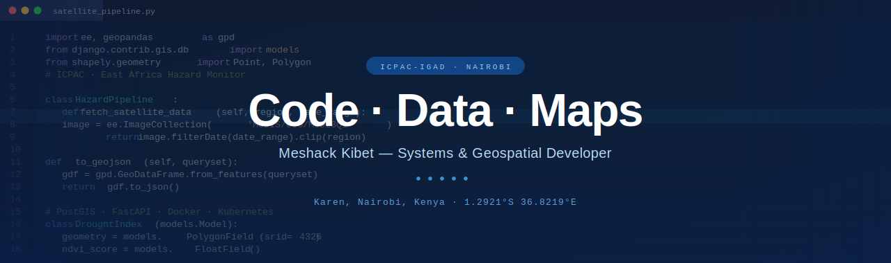

<!-- BANNER — code-screenshot background -->

<!-- TYPING -->

  

<!-- SOCIAL LINKS -->

  
  
  
  
  

 

<!-- ABOUT — 2-column: GIF + info -->
##  About Me

<table>
<tr>
<td width="45%" align="center">
  
</td>
<td width="55%" valign="top">

- 🛰️ &nbsp;**Satellite & climate data** → production systems that scale under heavy traffic
- 🧩 &nbsp;Full-stack: **frontend → backend → infra → pipelines**
- ⚙️ &nbsp;Deep in **Docker, Kubernetes, CI/CD, AWS / GCP**
- 🌍 &nbsp;**Food-security & disaster decisions** for millions
- 💬 &nbsp;Ask me about **WebGIS, geospatial pipelines, remote sensing**
- 📫 &nbsp;**mshckkibet@gmail.com** · [meshkibet.netlify.app](https://meshkibet.netlify.app/)

</td>
</tr>
</table>

 

| 🚀 Platforms shipped | 🌍 Countries served | 🛠️ Tech in daily use |
|:---:|:---:|:---:|
| **3+** | **11** | **35+** |

 

<!-- TECH STACK -->
## 🛠️ Tech Stack

**Languages**

**Web & Backend**

**Geospatial & Remote Sensing**

**Machine Learning**

**Databases**

**Cloud & DevOps**

 

<!-- FEATURED WORK -->
## 🚀 Featured Work

> Platforms actively used by governments, NGOs & researchers across the Horn of Africa.

| Project | What it does | Stack | Live |
|:--|:--|:--|:--:|
| **🌐 EA Hazards Watch** | Multi-hazard early-warning platform — floods, droughts & climate risk across 11 countries | `Django` `PostGIS` `Leaflet` `GEE` | [↗](https://eahazardswatch.icpac.net/) |
| **🌾 Drought Watch** | Satellite-driven drought & agriculture monitoring delivering food-security intelligence | `Python` `FastAPI` `GDAL` `PostgreSQL` | [↗](https://droughtwatch.icpac.net/) |
| **🛰️ ICPAC** | Climate intelligence hub: seasonal outlooks, data & regional services for East Africa | `Wagtail` `Django` `PostgreSQL` `Docker` | [↗](https://www.icpac.net/) |

 

<!-- GITHUB STATS -->
## 📊 GitHub Analytics

  
  

  

<!-- CONTRIBUTION HEATMAP -->

  

<!-- ACTIVITY OVERVIEW — below contributions -->

  

<!-- SNAKE -->

  

 

<!-- CONNECT -->
## 🤝 Let's Build Something

Working at the intersection of **climate, geospatial data, or systems engineering**? Open to collaborations, consulting, and good conversations.

  
  
  
  

<!-- FOOTER -->

