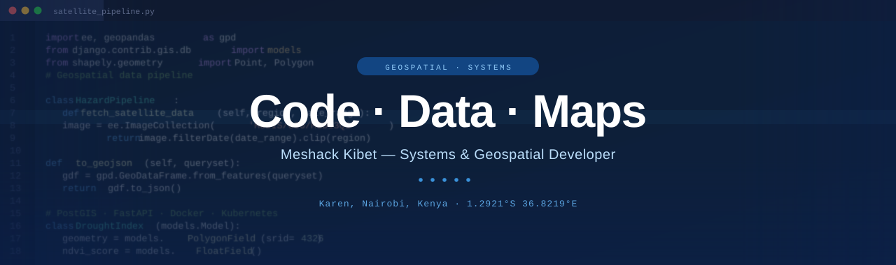

  <a href="https://meshkibet.netlify.app/">Portfolio</a>
  &nbsp;·&nbsp;
  <a href="https://www.linkedin.com/in/meshack-kibet-16b090389/">LinkedIn</a>
  &nbsp;·&nbsp;
  <a href="mailto:mshckkibet@gmail.com">Email</a>
  &nbsp;·&nbsp;
  <a href="https://drive.google.com/file/d/1nsX2l1x-Zv15YsQ0lOimJooy4rqd8QKh/view">CV</a>

 

## About

Systems and geospatial developer. I build full-stack web platforms and the data
pipelines behind them — satellite and climate data ingestion, spatial databases,
interactive maps, and real-time dashboards.

- **Full-stack** — frontend, backend, infrastructure, and data pipelines, end to end
- **Geospatial** — WebGIS, remote sensing, spatial databases, satellite imagery processing
- **Cloud &amp; DevOps** — Docker, Kubernetes, and CI/CD on AWS and GCP
- **Focus** — climate and environmental data systems built to scale

 

## Tech Stack

<table>
<tr>
<td width="36%" valign="middle" align="center">

</td>
<td width="64%" valign="top">

**Languages**

**Web &amp; Backend**

**Geospatial &amp; Remote Sensing**

**Machine Learning**

**Databases**

**Cloud &amp; DevOps**

</td>
</tr>
</table>
